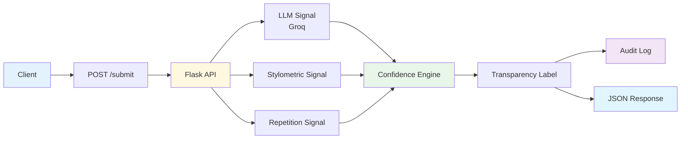
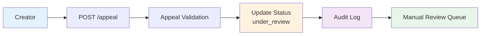

# Provenance Guard — AI Content Attribution & Transparency System

A multi-signal backend system that analyzes submitted writing to estimate whether
content is likely AI-generated or human-written. Provenance Guard combines
multiple independent detection signals, produces calibrated confidence scores,
generates reader-friendly transparency labels, records every decision in a
structured audit log, and provides an appeals workflow for creators who believe
their work has been misclassified.

This project was developed for **AI201 Week 4 – Show What You Know: Provenance Guard**.

---

# Project Overview

Modern creative platforms increasingly host content produced by both humans and
generative AI. Rather than attempting perfect AI detection, Provenance Guard is
designed to improve transparency by providing readers with attribution estimates,
confidence scores, and a fair appeals process whenever uncertainty exists.

The system intentionally treats false positives as more harmful than false
negatives. Instead of forcing every submission into a binary "AI" or "Human"
decision, Provenance Guard communicates uncertainty honestly and allows creators
to request manual review.

---

# System Features

## Project Highlights

- ✅ Three independent detection signals
- ✅ Weighted ensemble confidence scoring
- ✅ Reader-friendly transparency labels
- ✅ Appeals workflow with manual review status
- ✅ Structured JSON audit logging
- ✅ Rate limiting using Flask-Limiter
- ✅ REST API endpoints
- ✅ Mermaid architecture diagrams

## Core Features

- Multi-signal attribution pipeline
- Groq LLM semantic analysis
- Stylometric heuristic analysis
- Repetition / formulaic writing detection
- Weighted confidence scoring
- Human-readable transparency labels
- Appeals workflow
- Structured audit logging
- Rate limiting using Flask-Limiter
- REST API endpoints

---

## Stretch Features

- Ensemble detection using three independent signals
- Weighted confidence calculation
- Structured audit log with individual signal scores

---

# System Architecture

## High-Level Architecture



---

## Appeals Workflow



---

## Submission Flow

1. A creator submits text through the `/submit` endpoint.
2. The system analyzes the content using three independent detection signals.
3. Signal outputs are combined into a weighted confidence score.
4. The confidence score determines the attribution result.
5. A transparency label is generated for readers.
6. The decision is written to the audit log.
7. A structured JSON response is returned to the client.

If the creator disagrees with the result, an appeal may be submitted through the
`POST /appeal` endpoint. The system records the creator's reasoning, updates the
content status to **under_review**, and appends the appeal to the audit log for
future manual review.

---

# Technology Stack

| Component         | Technology                     |
| ----------------- | ------------------------------ |
| Backend Framework | Flask                          |
| AI Detection      | Groq (llama-3.3-70b-versatile) |
| Signal Processing | Pure Python                    |
| Rate Limiting     | Flask-Limiter                  |
| Configuration     | python-dotenv                  |
| Audit Storage     | Structured JSON                |
| Language          | Python 3.12                    |

---

# Detection Pipeline

Rather than relying on a single AI detector, Provenance Guard combines multiple
independent signals that capture different characteristics of writing. Each
signal contributes evidence toward the final attribution decision while also
acknowledging its own limitations.

Using multiple signals helps reduce overconfidence and makes the final
confidence score more robust than relying on a single heuristic.

---

## Signal 1 — LLM Semantic Analysis

**Purpose**

The Groq-hosted LLM evaluates whether the writing resembles language patterns
commonly associated with AI-generated text.

It looks for characteristics such as:

- overly polished wording
- repetitive sentence structures
- generic transitions
- consistently formal tone
- predictable organization

**Output**

```
0.0 → likely human

1.0 → likely AI
```

Example:

```json
"llm_score": 0.90
```

### What this signal misses

LLMs can confidently misclassify:

- edited human writing
- academic papers
- technical documentation
- professional blog posts

Because of these limitations, this signal is never used alone.

---

## Signal 2 — Stylometric Analysis

**Purpose**

Stylometric analysis measures writing style rather than meaning.

The heuristic evaluates properties such as:

- sentence length variation
- punctuation diversity
- vocabulary diversity
- writing rhythm

Human writing generally contains greater natural variation, while AI-generated
text often appears more uniform.

Example:

```json
"stylometric_score": 0.78
```

### What this signal misses

Stylometric heuristics may incorrectly classify:

- carefully edited essays
- professional reports
- highly structured documentation

This signal complements the LLM instead of replacing it.

---

## Signal 3 — Repetition Detection

**Purpose**

The repetition heuristic measures how frequently phrases, transitions, and
sentence structures repeat throughout a submission.

Examples include repeated expressions such as:

- "It is important to note..."
- "Furthermore..."
- "In conclusion..."

Highly repetitive writing is more commonly associated with AI-generated text,
although repetition alone is not sufficient evidence.

Example:

```json
"repetition_score": 1.00
```

### What this signal misses

Repetition also appears naturally in:

- educational writing
- legal documents
- policy documents
- instructional material

Therefore repetition contributes only part of the final confidence score.

---

# Ensemble Confidence Scoring

The final attribution score is produced by combining all three signals using a
weighted average.

Current weights:

| Signal               | Weight  |
| -------------------- | ------- |
| LLM Analysis         | **50%** |
| Stylometric Analysis | **30%** |
| Repetition Detection | **20%** |

Formula:

```
confidence =
0.50 × llm_score
+
0.30 × stylometric_score
+
0.20 × repetition_score
```

The final confidence score is rounded to three decimal places before generating the transparency label and attribution result.

The weighted approach intentionally gives the LLM the greatest influence while
still allowing stylometric and repetition evidence to adjust the final result.

---

# Confidence Thresholds

| Confidence Score | Attribution           |
| ---------------- | --------------------- |
| **0.75 – 1.00**  | Likely AI-generated   |
| **0.40 – 0.74**  | Attribution Uncertain |
| **0.00 – 0.39**  | Likely Human-written  |

These thresholds intentionally create an uncertainty region rather than forcing
every submission into a binary classification.

---

# Validation Strategy

To verify that confidence scores behaved as expected, the system was tested with
multiple categories of text:

| Test Case                 | Expected Result             |
| ------------------------- | --------------------------- |
| Casual personal story     | Likely Human                |
| Formal AI-style essay     | Likely AI or Uncertain      |
| Mixed writing style       | Uncertain                   |
| Highly repetitive content | Higher confidence toward AI |

Testing confirmed that different inputs produced noticeably different signal
scores and confidence values, demonstrating that the ensemble behaves more
reasonably than any individual detector alone.

Representative test cases included casual personal writing, formal AI-style essays, mixed writing styles, and highly repetitive text to verify that the ensemble detector responded differently across diverse inputs.

---

# Transparency Labels

Unlike traditional AI detectors that return only a score, Provenance Guard
generates plain-language transparency labels designed for non-technical readers.

The wording intentionally communicates uncertainty instead of presenting the
system as perfectly accurate.

| Attribution               | Label                                                                                                                                                                                                                    |
| ------------------------- | ------------------------------------------------------------------------------------------------------------------------------------------------------------------------------------------------------------------------ |
| **Likely AI-generated**   | "Likely AI-generated. Our system found strong evidence that this content may have been generated with AI. This result is an estimate, not proof, and the creator may submit an appeal."                                  |
| **Attribution Uncertain** | "Attribution uncertain. Our system could not confidently determine whether this content was written by a person or generated with AI. Readers should treat this as contextual information rather than a final judgment." |
| **Likely Human-written**  | "Likely human-written. Our system found stronger evidence that this content was primarily written by a person. This result is an estimate and should not be considered a guarantee."                                     |

The transparency label changes automatically according to the calculated
confidence score.

---

# REST API

Base URL

```
http://localhost:5000
```

## POST /submit

Submits content for attribution analysis.

### Request

```json
{
  "text": "Your text here",
  "creator_id": "student123"
}
```

### Response

```json
{
  "attribution": "likely_human",
  "confidence": 0.239,
  "signals": {
    "llm_score": 0.2,
    "stylometric_score": 0.462,
    "repetition_score": 0.0
  },
  "label": "Likely human-written...",
  "status": "classified"
}
```

---

## POST /appeal

Allows a creator to contest an attribution decision.

### Request

```json
{
  "content_id": "xxxxxxxx",
  "creator_reasoning": "I wrote this content myself and request manual review."
}
```

### Response

```json
{
  "success": true,
  "status": "under_review",
  "message": "Appeal submitted successfully."
}
```

---

## GET /log

Returns the structured audit log.

Example:

```json
{
    "entries":[
        ...
    ]
}
```

---

# Appeals Workflow

Creators who believe their work has been incorrectly classified may submit an
appeal using the `/appeal` endpoint.

Submitting an appeal performs the following actions:

1. Validates the provided content ID.
2. Updates the original classification status to **under_review**.
3. Records the creator's reasoning.
4. Creates a new appeal event.
5. Stores both records in the structured audit log.
6. Returns confirmation to the client.

The system intentionally does **not** automatically re-classify content. Appeals
are intended for future manual review.

---

# Rate Limiting

To reduce automated abuse, the submission endpoint is protected using
Flask-Limiter.

Current limits:

| Limit                    | Purpose                                                        |
| ------------------------ | -------------------------------------------------------------- |
| **10 requests / minute** | Prevent rapid automated flooding                               |
| **100 requests / day**   | Prevent long-term abuse while allowing normal creator activity |

These values were selected to reflect realistic usage on a writing platform.
Most legitimate users submit only a handful of drafts during a writing session,
while automated abuse typically involves many rapid requests.

When the rate limit is exceeded, Flask automatically returns an HTTP **429 Too
Many Requests** response.

---

# Audit Log

Every important system action is permanently recorded in a structured JSON audit
log.

Each classification entry contains:

- timestamp
- content ID
- creator ID
- attribution result
- confidence score
- transparency label
- individual signal scores
- current status

Appeal entries additionally include:

- creator reasoning
- appeal timestamp
- under_review status

The audit log provides transparency, traceability, and future support for manual
review without modifying the original classification record.

---

# Testing Results

The system was manually tested using multiple input types to verify that the
detection pipeline, confidence scoring, transparency labels, appeals workflow,
rate limiting, and audit logging all behaved as expected.

| Test Case               | Expected Outcome                       | Result    |
| ----------------------- | -------------------------------------- | --------- |
| Casual personal story   | Likely Human                           | ✅ Passed |
| AI-style formal writing | Likely AI / Uncertain                  | ✅ Passed |
| Mixed writing           | Uncertain                              | ✅ Passed |
| Appeal submission       | Status updated to `under_review`       | ✅ Passed |
| Audit log               | Structured JSON entry created          | ✅ Passed |
| Rate limiting           | HTTP 429 returned after limit exceeded | ✅ Passed |

The confidence score changed appropriately across different writing styles,
demonstrating that the multi-signal ensemble responds differently to varying
inputs instead of producing a fixed prediction.

---

# Running Locally

## Clone Repository

```bash
git clone https://github.com/tbnguye9/ai201-project4-provenance-guard.git
```

## Install Dependencies

```bash
pip install -r requirements.txt
```

## Configure Environment

Create a `.env` file:

```text
GROQ_API_KEY=your_api_key_here
```

## Run

```bash
python app.py
```

The server starts on:

```
http://localhost:5000
```

Available endpoints

```
POST /submit
POST /appeal
GET /log
```

---

# Repository Structure

```text
ai201-project4-provenance-guard/

├── app.py               # Flask API endpoints
├── detector.py          # Multi-signal detection pipeline
├── scoring.py           # Confidence score calculation
├── labels.py            # Transparency label generation
├── appeals.py           # Appeals workflow
├── audit.py             # Audit logging
├── database.py          # JSON storage utilities
├── planning.md          # Project design specification
├── README.md
├── requirements.txt
└── logs.json            # Structured audit log
```

---

# Known Limitations

Although Provenance Guard combines multiple signals, it is **not a proof of
authorship**.

Some content types remain challenging:

- Academic research papers
- Technical documentation
- Legal writing
- Highly edited human writing
- AI-assisted human writing

These writing styles often resemble AI-generated language because they contain
consistent structure, formal vocabulary, and limited stylistic variation.

Likewise, sophisticated AI-generated writing may intentionally imitate human
variation, making attribution more difficult.

For these reasons, the system intentionally reports uncertainty instead of
forcing binary decisions.

---

# Spec Reflection

The original design proposed a two-signal detection pipeline consisting of an
LLM classifier and stylometric heuristics.

During implementation, a third repetition-detection heuristic was added to
improve robustness. This evolved the project into an ensemble detector with
weighted confidence scoring rather than relying on only two independent signals.

The confidence thresholds were also adjusted after testing several writing
samples. Instead of making aggressive AI predictions, the final implementation
uses a broader uncertainty region to reduce false positives and better reflect
the inherent uncertainty of AI attribution.

These implementation changes improved transparency while remaining faithful to
the goals established in the planning document.

---

# AI Usage

AI tools were used throughout development to accelerate implementation while all
design decisions, testing, and final revisions remained under student control.

## Example 1 — Architecture Design

AI was prompted with the project specification and planning document to generate
an initial Flask API architecture and endpoint organization.

The generated design was revised by selecting a simpler modular structure
(`app.py`, `detector.py`, `scoring.py`, `labels.py`, `appeals.py`, and
`audit.py`) that better matched the project requirements.

---

## Example 2 — Detection Pipeline

AI assisted in drafting the initial implementations for stylometric heuristics,
confidence scoring, and transparency label generation.

The scoring thresholds, signal weights, and label wording were manually revised
after testing multiple human-written and AI-style submissions. Additional
changes included introducing a repetition signal and expanding the uncertainty
region to reduce false positives.

All AI-generated suggestions were manually reviewed, tested, and revised before being incorporated into the final implementation.

---

# Future Improvements

Potential future enhancements include:

- Human verification certificates
- Multi-modal attribution for images
- Analytics dashboard
- Manual reviewer interface
- Database-backed audit storage
- Machine learning calibration using labeled datasets
- User authentication
- Web dashboard for submissions and appeals

---

# License

This project was developed as part of **AI201 – Week 4: Provenance Guard** for
educational purposes.
